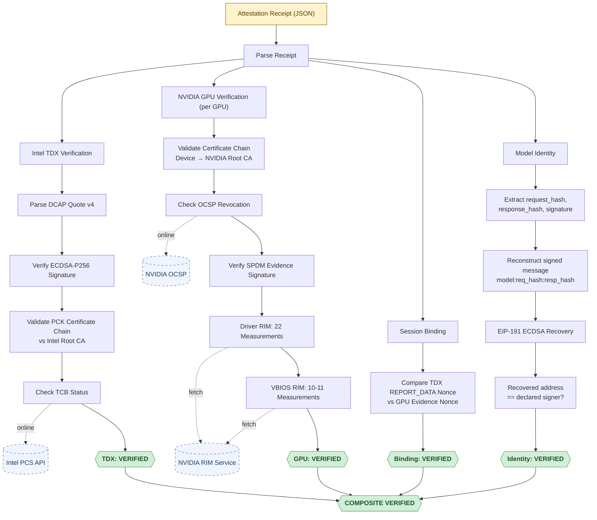

# tee-verify

[](https://pypi.org/project/tee-verify/)
[](https://www.python.org/downloads/)
[](https://github.com/Sid-Lais/attestation-check/blob/main/LICENSE)
[](https://github.com/Sid-Lais/attestation-check/actions/workflows/ci.yml)

**Independent verification of TEE attestation receipts. No trust required.**

## The Problem

Every AI platform asks you to trust that their infrastructure is secure. But trust is not verification. If an AI provider runs models inside a Trusted Execution Environment and gives you a cryptographic attestation receipt, you should be able to verify it yourself — without relying on the provider's own tools.

## Quick Start

```bash
pip install tee-verify
```

```bash
# Verify an OLLM attestation receipt
tee-verify --ollm-json receipt.json

# Verbose output with per-GPU details
tee-verify --ollm-json receipt.json --verbose

# JSON output for programmatic use
tee-verify --ollm-json receipt.json --output json

# Offline mode (skip Intel PCS + NVIDIA OCSP network calls)
tee-verify --ollm-json receipt.json --offline

# Verify individual components
tee-verify --tdx-quote quote.hex
tee-verify --tdx-quote quote.hex --nvidia-cert cert.b64 --nvidia-evidence ev.b64
```

## Try It With a Live Attestation

Want to verify a real confidential AI inference? Sign up at [ollm.com](https://ollm.com), send any chat request, and grab the attestation receipt from [console.ollm.com](https://console.ollm.com). Save the receipt JSON and run:

```bash
tee-verify --ollm-json receipt.json --verbose
```

## What It Verifies

- **Intel TDX** — Parses the TDX DCAP Quote v4, verifies the ECDSA-P256 signature, validates the PCK certificate chain against Intel's Root CA, and checks TCB status via Intel's Provisioning Certification Service.
- **NVIDIA GPU Attestation** — Validates the GPU certificate chain (device to NVIDIA Root CA), checks revocation via OCSP, verifies the SPDM evidence signature using the device certificate, and validates all firmware measurements against NVIDIA's signed Reference Integrity Manifests — both driver firmware (22 measurements) and GPU BIOS firmware (10-11 measurements).
- **Session Binding** — Cross-checks the attestation nonce between the TDX quote and every GPU evidence blob, proving they belong to the same TEE session.
- **Model Identity** — Verifies the ECDSA signature over `EIP-191(model:sha256(request):sha256(response))`, confirming that the declared model signing authority processed this exact request and response. Reads `request_hash` and `response_hash` directly from the receipt. Also supports manual `--request-body` / `--response-body` flags and auto-probes other known signing formats.

## How It Works

A TEE attestation receipt contains two independent proofs:

1. The **Intel TDX quote** proves the CPU is running inside a genuine Trust Domain with a specific software measurement (MRTD). The quote is signed by Intel's Quoting Enclave using a Platform Certification Key traceable to Intel's root of trust.

2. The **NVIDIA GPU evidence** proves each GPU in the cluster is a genuine NVIDIA device running verified firmware. Each GPU produces an SPDM measurement report signed by its device-specific attestation key, with a certificate chain rooted in NVIDIA's PKI. The firmware measurements are cross-checked against NVIDIA's signed Reference Integrity Manifests for both the GPU driver and GPU BIOS, confirming no firmware component has been modified.

3. The **model identity signature** proves the declared signing authority attested to this specific inference. The signature is verified using ECDSA recovery over the request and response hashes embedded in the receipt.

The receipts are cryptographically bound together by a shared nonce: the GPU attestation nonce must appear in the TDX quote's REPORT_DATA field, proving both attestations were generated in the same session.

`tee-verify` checks all of this independently — no vendor SDKs, no trust assumptions.

## Verification Flow

The following diagram shows the complete verification pipeline — every cryptographic check `tee-verify` performs on an attestation receipt, the external trust anchors it validates against, and how the results combine into a final composite verdict.



> **Dashed lines** represent optional online checks — these are skipped in `--offline` mode. All other checks are performed locally using only the receipt data and the hardware vendors' root certificates.

## Using as a Library

```python
from tee_verify.formats.ollm import from_file
from tee_verify.verifier import verify_from_receipt

# Load and verify an OLLM receipt
receipt = from_file("receipt.json")
result = verify_from_receipt(receipt, offline=False)

print(result.overall_status)        # "VERIFIED"
print(result.tdx.mrtd)              # TD measurement hash
print(result.tdx.nonce)             # Session nonce
print(result.nonce_binding_valid)   # True
print(len(result.nvidia_gpus))      # 8
print(result.model_identity.status) # "VERIFIED"

# Get structured output
print(result.to_json())

# Or verify individual components
from tee_verify.tdx.verifier import verify_tdx_quote

tdx_result = verify_tdx_quote(quote_hex, offline=True)
print(tdx_result.status)  # "VERIFIED"
```

## CLI Reference

```text
Usage: tee-verify [OPTIONS] [INPUT_PATH]

  Independently verify TEE attestation receipts. No trust required.

Options:
  --tdx-quote PATH             Path to TDX quote hex file
  --nvidia-cert PATH           Path to NVIDIA cert chain (base64)
  --nvidia-evidence PATH       Path to NVIDIA evidence (base64)
  --ollm-json PATH             Path to OLLM attestation receipt JSON file
  --request-body PATH          Path to request body file (model identity verification)
  --response-body PATH         Path to response body file (model identity verification)
  --output [text|json]         Output format (default: text)
  --offline                    Skip online checks (Intel PCS, NVIDIA OCSP)
  --verbose                    Show detailed output
  --version                    Show version
  --help                       Show this message and exit
```

## Running Tests

```bash
git clone https://github.com/Sid-Lais/attestation-check.git
cd tee-verify
pip install -e ".[dev]"
pytest tests/ -v
```

## Background: What Is TEE Attestation?

A Trusted Execution Environment (TEE) is a hardware-enforced isolated execution context. Intel TDX creates Trust Domains — encrypted virtual machines where not even the hypervisor can read the memory. NVIDIA's Hopper GPUs extend this trust boundary to the GPU, enabling confidential AI inference where the model weights and user prompts are never exposed to the host.

Attestation is the cryptographic proof that a TEE is genuine and running expected software. The hardware generates a signed report (a "quote" in Intel terminology) containing measurements of the loaded software. Anyone can verify this signature against the hardware vendor's root of trust to confirm: this code is really running on that hardware, and no one — not even the cloud provider — can tamper with it.

## Built by ORGN

tee-verify is built and maintained by ORGN. ORGN's backend gateway OLLM runs AI models inside TEEs and produces the attestation receipts this tool verifies.

## Contributing

See [CONTRIBUTING.md](CONTRIBUTING.md) for development setup and guidelines.

## License

Apache License 2.0 — see [LICENSE](LICENSE) for details.
